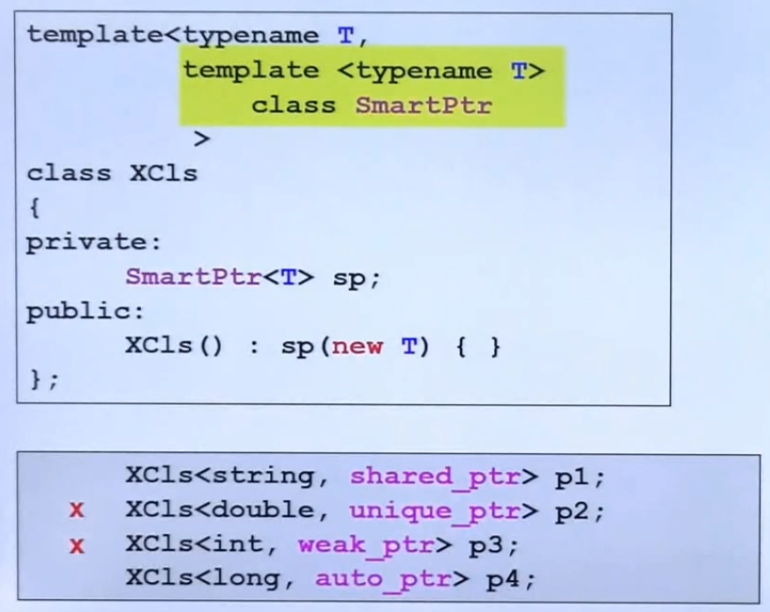

## 智能指针与迭代器 - pointer-like-class

- **shared_pointer**
	
    包含类特性的指针
    
	
	- 智能指针内部一定包含了一个真实的指针（**px**），指向具体的对象；所以只能指针完成了对传统指针的封装，并具有了一些新特性
	- 注意 **operator->()** 的重载写法

- **迭代器**
	
    用于访问标准库容器的指针
    
    
    
    - 注意到迭代器的**->**,**\***重载的写法与智能指针写法相对不同

## 仿函数 - function-like-class
	
核心是完成对 **operator()** 的重载


- 注意仿函数的调用方法
	```C++
    // 前一个 () 表示构建对象，后面表示操作符重载
    select1st<pair>()();
    ```
 
## namespace 经验谈    


- 针对同一项目中的不同组件，组件之间有共性，往往通过命名空间使组件相互独立
 
## 类模板


## 函数模板


## 成员模板


- 由于类本身已经是一个模板类，成员函数也是一个模板
- 这种写法可以通过传入一个子类模板进行父类对象构造
	```C++
    template<typename U1, typename U2>
    pair(const pair<U1,U2>& p);
    ```
- 由于构造函数涉及到子类到父类转换，所以 $<U1,U2>$ 必须是 $<T1,T2>$ 的子类


## 特化以及偏特化


- 偏特化（个数上的偏，仅绑定其中一个类别）

	
    
- 偏特化（范围上的偏，任意范围限定为指针）

	
    
## 模板模板参数


- 由于 **Container** 本身需要指定模板参数，且模板参数待指定，所以需要写成

	```C++
    template<typename T>
    class container
    ```
- 需要将 list 的模板第二参数指定，才能正常使用    



- 不是模板模板参数的情形
	
	