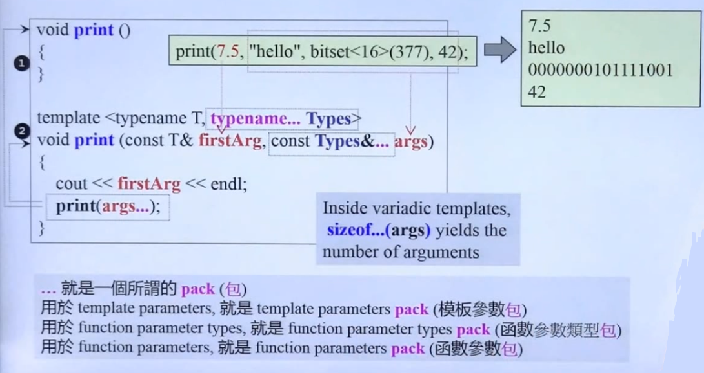
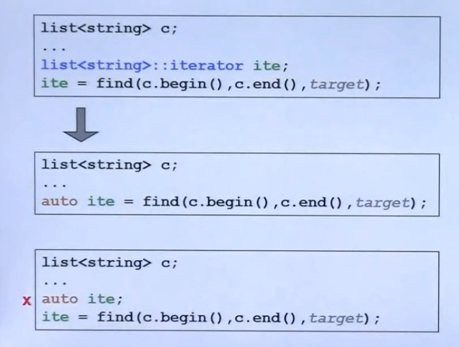
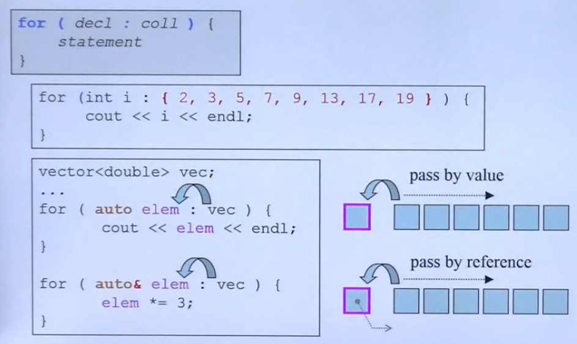
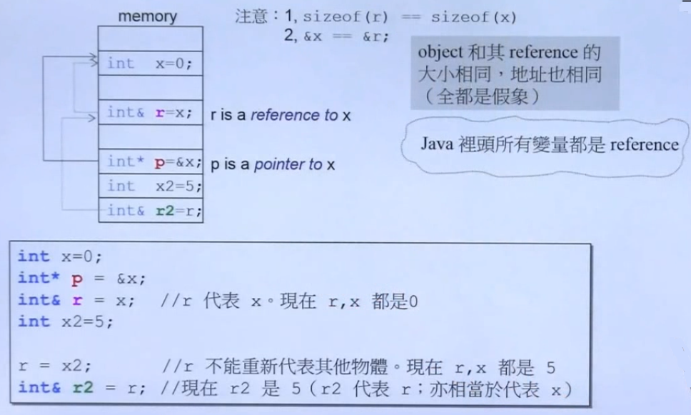
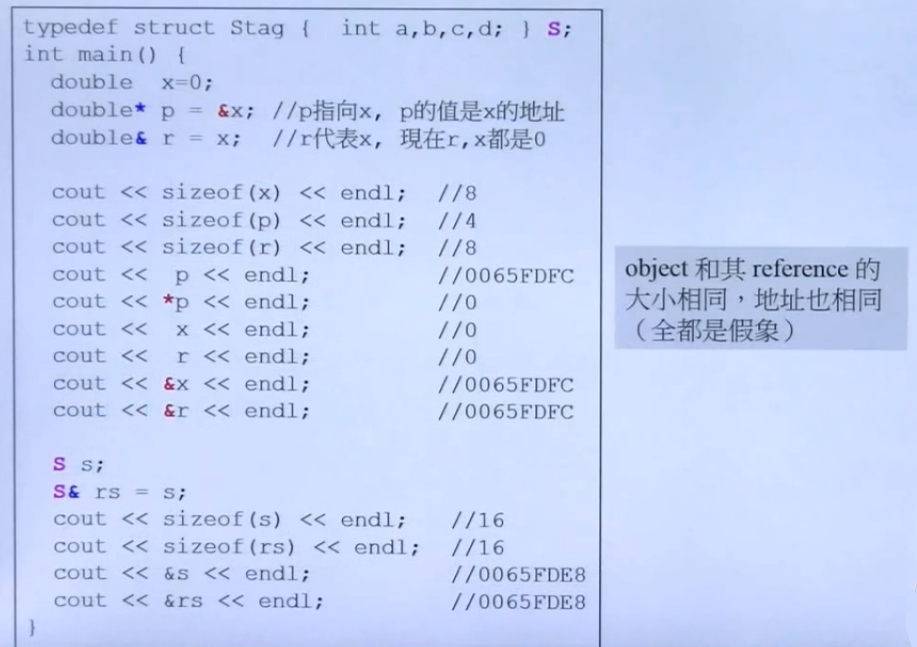
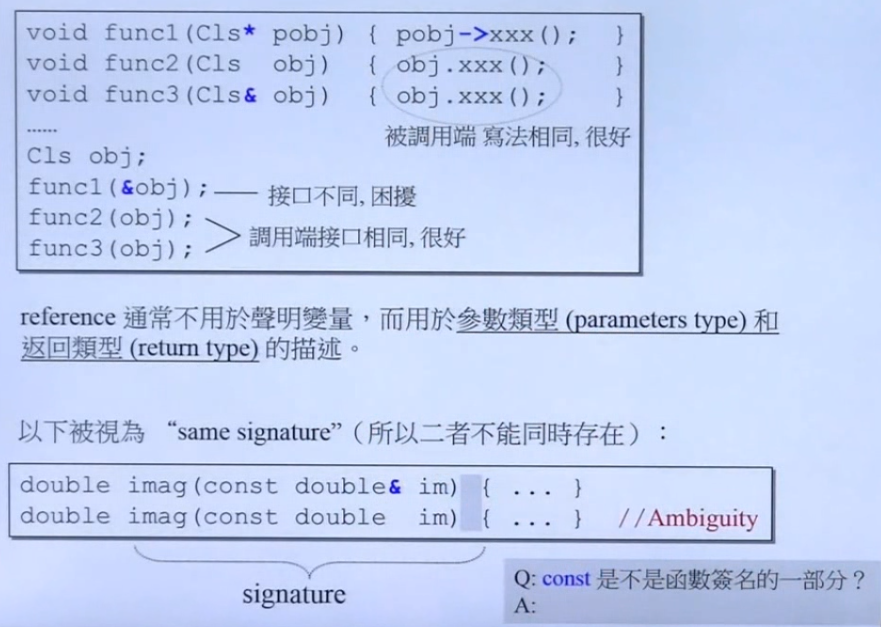

## 三个主题

- 可变模板参数

	
    - 一种可变参数模板支持传入参数：**1 + n** 的传入形式
    - 由于递归到最深时，没有参数传入，所以必须声明 **void print()**
    - **sizeof...(args)** 获取 **args** 的数量


- auto

	
    - auto 不能直接声明变量，必须要提供编译器推理的依据

- for range 语法
	
    
	- 支持 **initialize list {}** 传入


## Reference
 
 
- **\*** 表示 **pointer to ...**
- **&** 表示 **代表**，reference 内部也是通过指针实现

	```C++
    int& r = x; // x 必须被初始化，r 就无法被改变
    ```

- 测试程序

	
    
- reference 常见用途

	
	- 尝尝用作函数参数传入
	- 签名包含函数名与参数，但不包含返回类型

		```C++
        // 不能并存的情形
        double imag(const double& img) {...}
        double imag(const double img) {...}
        
        // 可以并存的情形
        double imag() const {...}
        double imag() {...}
        ```