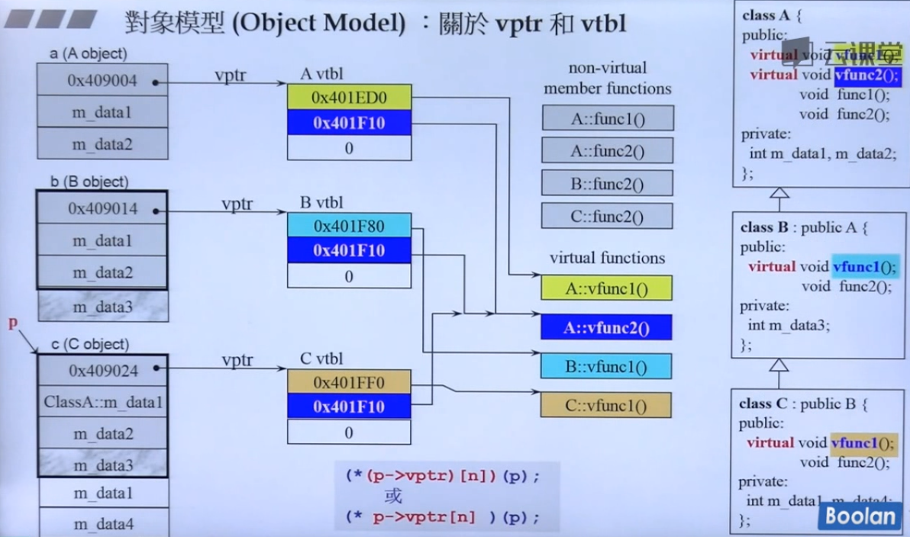
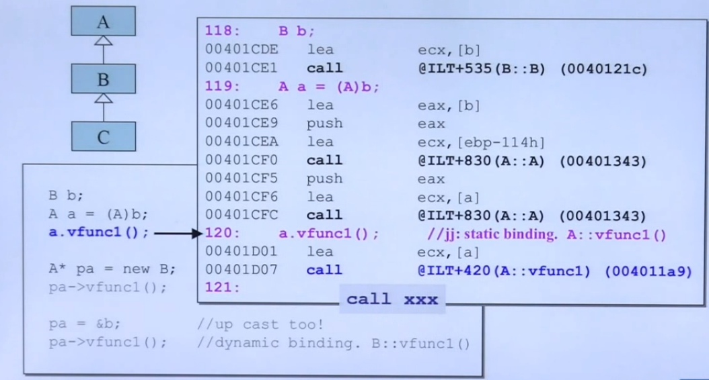
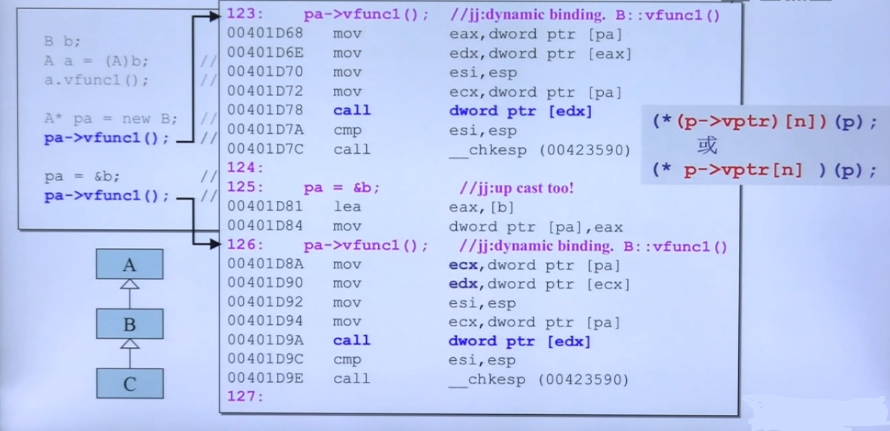
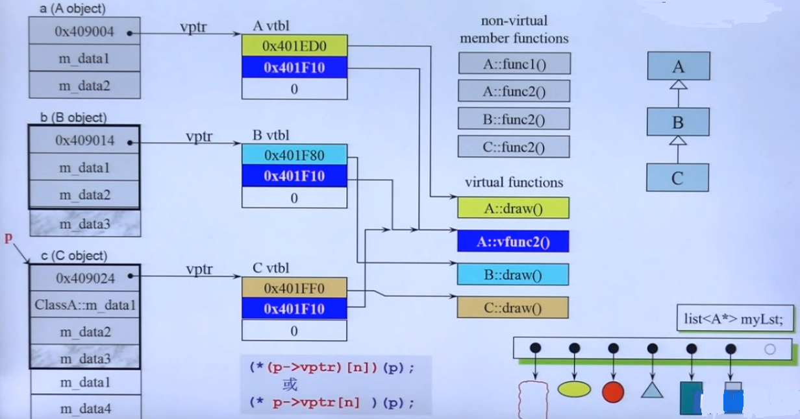
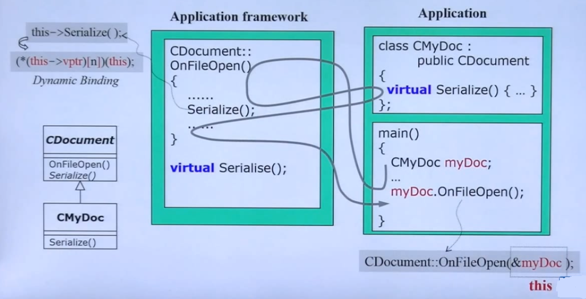

## 虚指针与虚表

- 关于 虚指针 和 虚表

	
    - 只要类中存在虚函数，对象的内存中就会多存在一个指针（多4个字节）
    - 子类与父类成员函数可以同名但不推荐
    - 各个对象的虚表中存在的虚指针指向包含的虚函数
    - 继承的对象在虚表中存在重写的虚函数指针以及自己独有的虚函数，不再拥有继承自父类的虚函数指针
    - **静态绑定与动态绑定**

		- 静态绑定指的是在编译阶段，就将被调用的函数地址显式声明在函数中，在运行时直接调用即可（\*p->vptr[n])中的**n**在编译时进行确定）
		
		- 动态绑定则是在运行时通过对象的虚表查到对应的函数地址，动态的选择调用（\*p->vptr[n])中的**n**在运行时进行确定）
 		
  
  
 - 一个容器容纳继承于父类的不同子类元素，应当以父类的指针类型存在，这样就能保证一个容器内各个元素大小相同
 - 子类虽然以父类的指针存在容器中，但是因为在虚表中存在对应子类的虚函数指针调用虚函数
 - 所以要实现上述功能（动态绑定）就必须满足三条件：
    - 必须要通过一个指针调用
    - 这个指针必须是子类向上（父类）转型的指针
    - 需要子类继承并重写的函数一定要是虚函数
 - 同时 A 的指针，但是实质是子类以及子类调用的虚函数，就是多态

## 关于 this 指针

- **this** 指代了 调用函数的对象
- 成员函数一定都有一个隐藏的 **pointer** 参数 