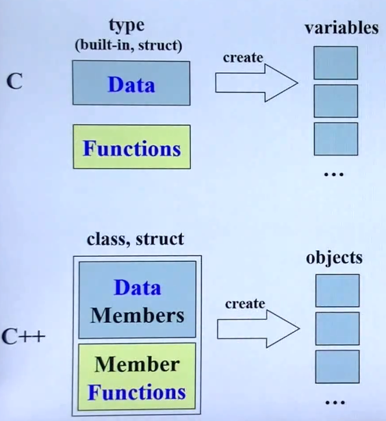
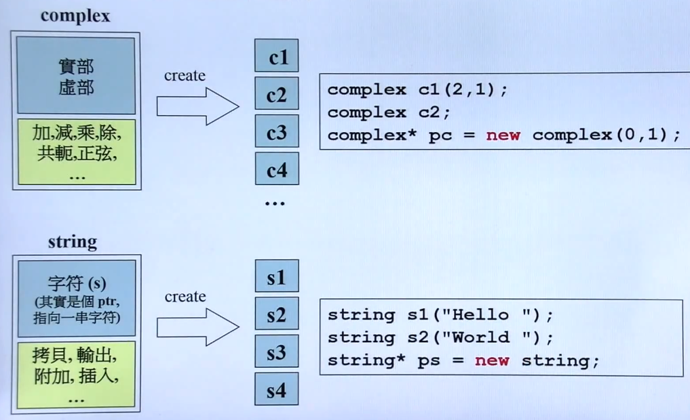
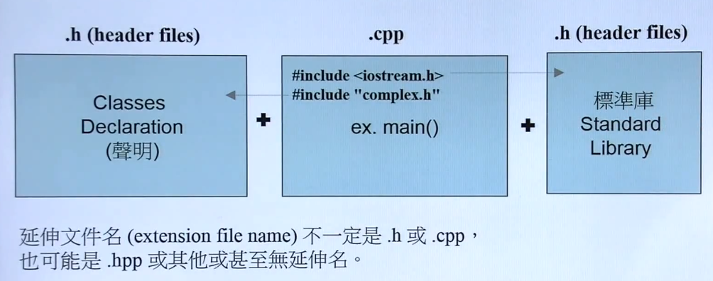
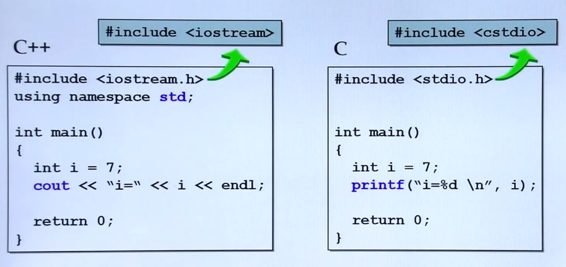
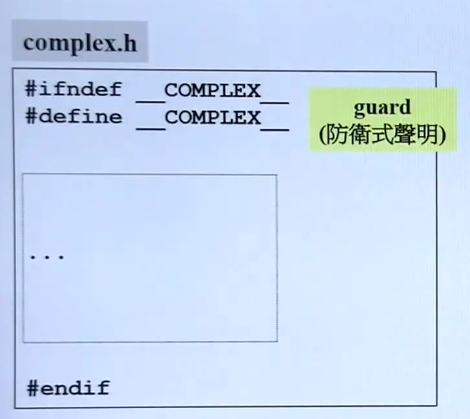
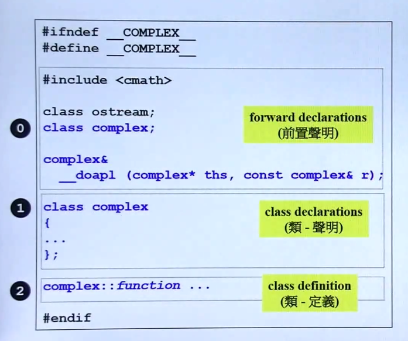
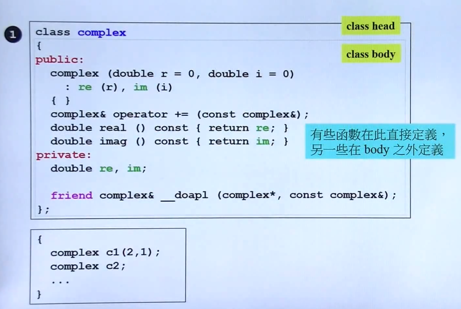
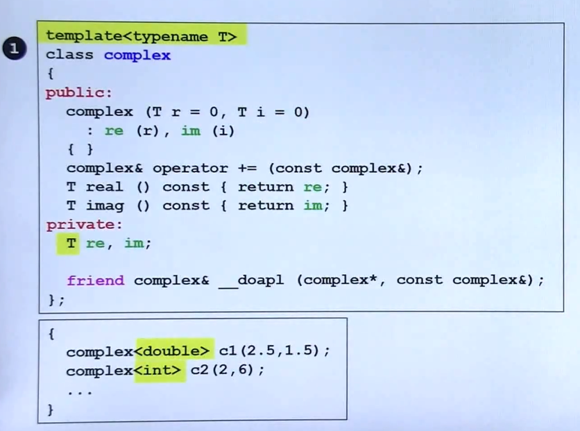

## 头文件与类的声明

- C 面向过程 与 C++ 面向对象的区别
	
    C++ class 实现了 数据与函数的封装，通过一个 Object 进行操作，类似于 C 中 struct
    
   
- class 的分类

	- 按 C++ 内部是否存在指针进行分类

		
- C++ 的编程形式        
     
     
- C、C++ 的输出流
	 

- 头文件的防卫式声明

	 

- Header 的布局

	 

- class 的声明

	 
 
- 类模板的定义

	