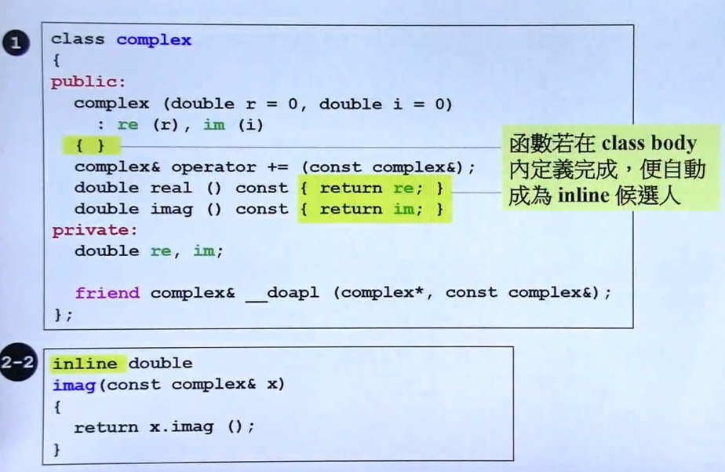
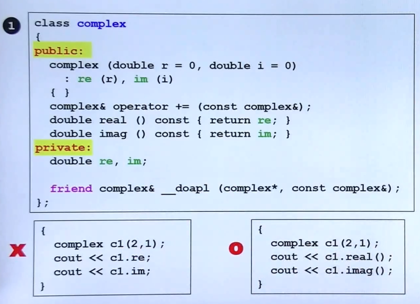
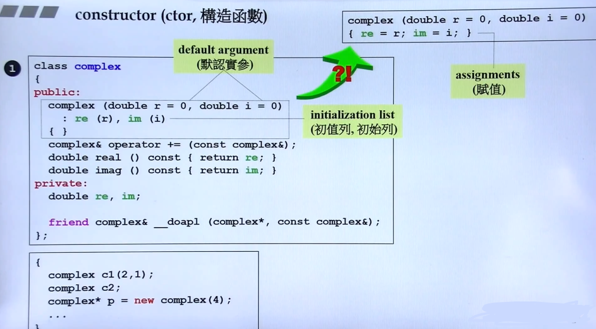
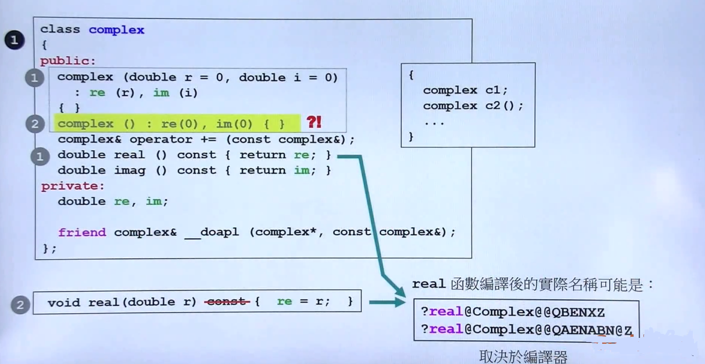
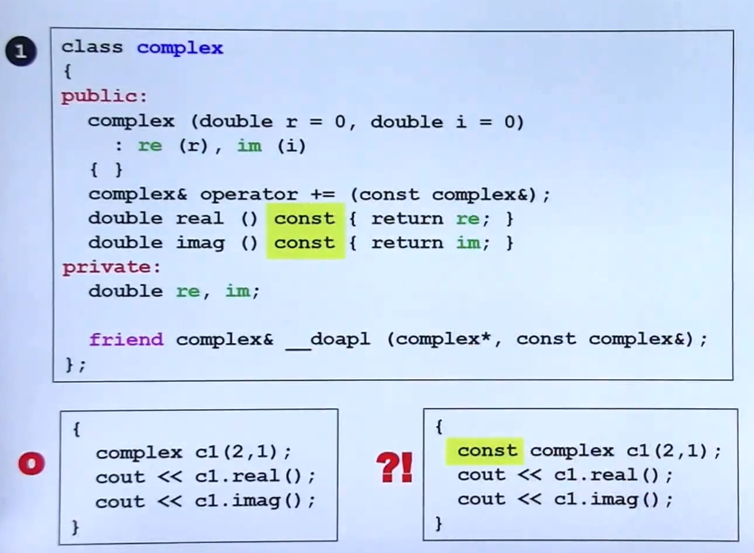
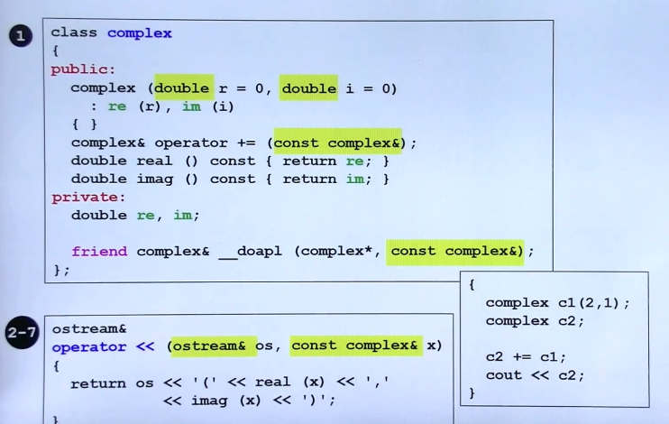
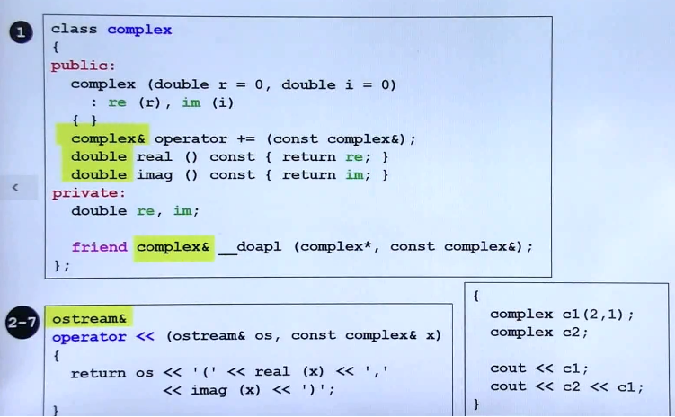
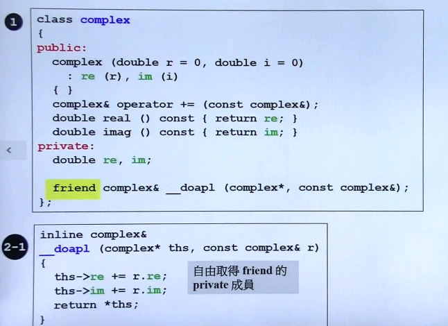
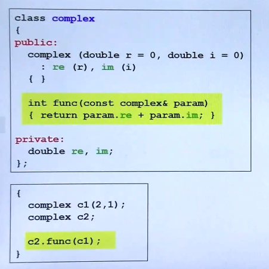
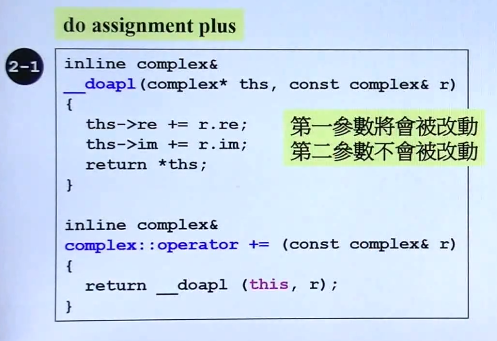

## 构造函数

- 内联函数

	类的 class body 内定义，默认为 **inline 函数**
    
    **inline 函数的有效性取决于编译器**
    
    
    
- 访问级别

	- public

		外界可以访问， 如 **real(), imag()**
        
    - private

		只有 class 内的成员变量以及函数可以访问，如 **re**, **im**
    
  
  
- 构造函数
	
    - 构造函数的基本概念
        构建对象的函数

        函数名称与类名称相同

        默认构造函数，即**创建对象时不提供参数**

        函数体往往根据传入的属性进行赋值或初始化某些参数

         
      
    - 构造函数的重载
    
    	- 编译器会重新命名重载函数
		- 无法重载多次默认构造函数

        
        
   - 将构造函数放在 **private**，即该类不允许构造对象（如单例模式）

		

- 常成员函数

	函数 加入 **const** 表明不改变数据内容
    
    
    
    - **const 成员函数支持const 对象访问，否则无法访问**
    
- 参数传递的方式： by value vs by reference （to const）

	- 传递 value 往往存在 copy 消耗
	- C 语言传递指针提高性能
	- C++ 语言使用 reference 代替指针
	- **建议使用 by reference 代替 by value**
	
    
- 返回值传递方式： **by value** vs **by reference**

	- 同样**建议使用 by reference 代替 by value**
	
    
- 友元函数

	- 可以直接访问类的 private 成员
	
    
    - 相同 class 的各个 object 互为友元（一个对象的成员函数可以处理另一个对象的 private 成员）
	
    
- **类的设计基本原则**

	- 数据尽可能封装在 **private** 中
	- pass by reference （to const [必要情形]）
	- 尽量 return by reference

		- 不能 return by reference 的情形
		
        	- 对于函数中创建的变量作为返回值时，不能使用 by reference，因为这个变量会在函数调用结束后被销毁
        	- 其他情况都可以 by reference
			
	- 类成员函数满足常成员函数条件就要加 const
	- 构造函数的初始化列表