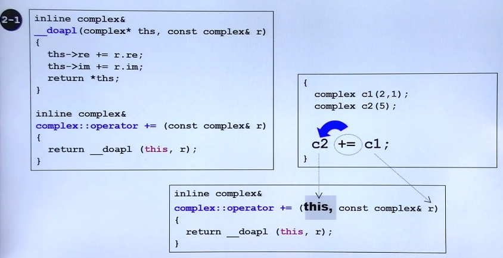
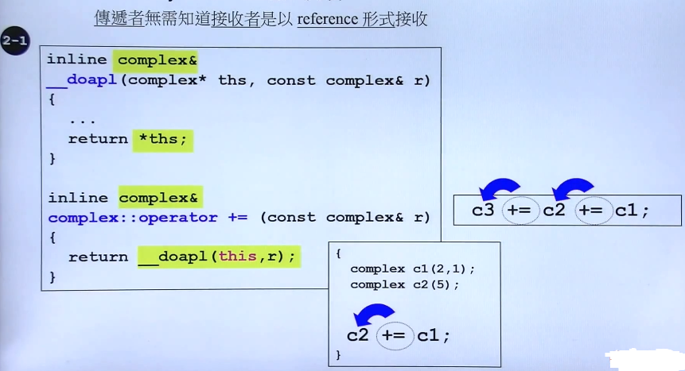
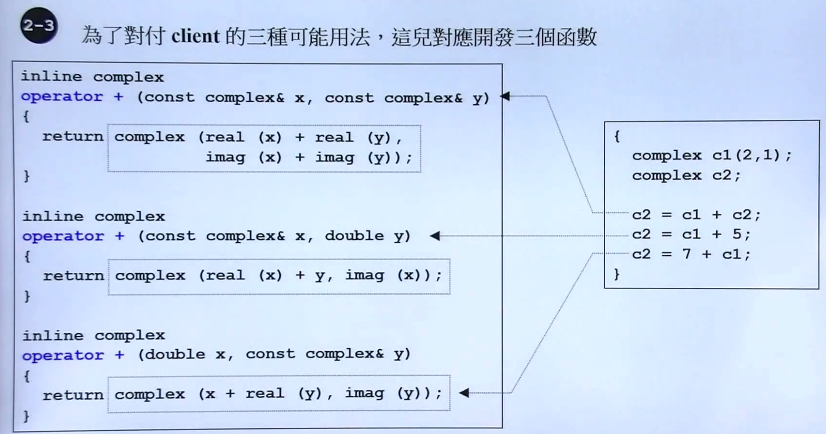
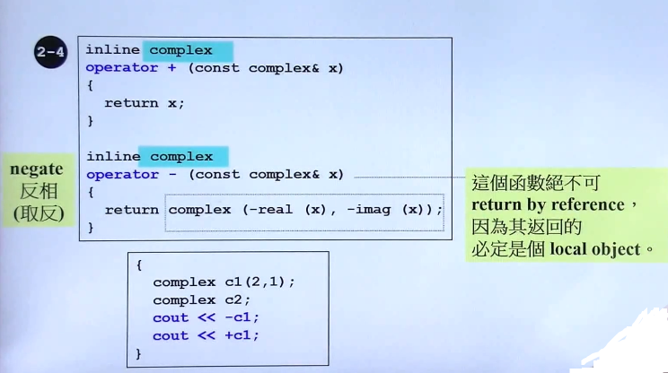
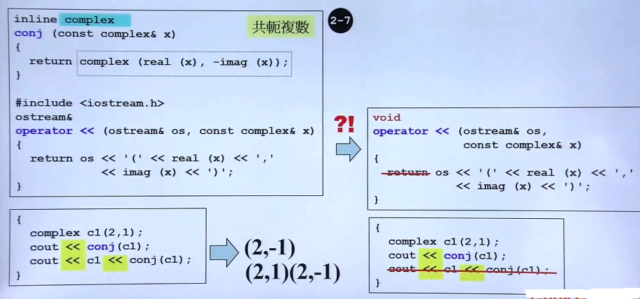

## 操作符重载与临时对象 

- 操作符重载

	- 作为成员函数重载

		- 编译对重载运算符的看待方式,即所有成员函数都有个隐藏的参数 this (指针)
		- 调用外部函数实现内部成员函数，但是要显式给出 this
        
        
    - return by reference 与 return by pointer

		传递者无需知道接收者是以 reference 形式接收
        
        
    - 作为非成员函数

		
        
        - 由于三个函数传递出的是局部对象，不能 return by reference

			
        
        - **非成员函数的使用情形**

			1. 涉及到类的对象与其他类之间的操作，则应把这个操作函数声明为非成员函数
			2. 输入输出操作符重载一般都是作为非成员函数使用，并加上 friend，避免了特殊写法 c1 << cout

 - 输入输出流的操作符重载

	