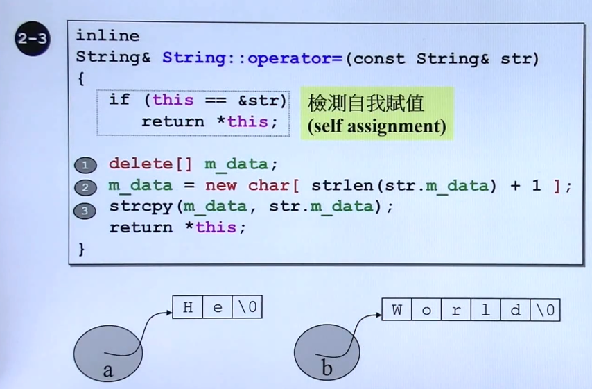
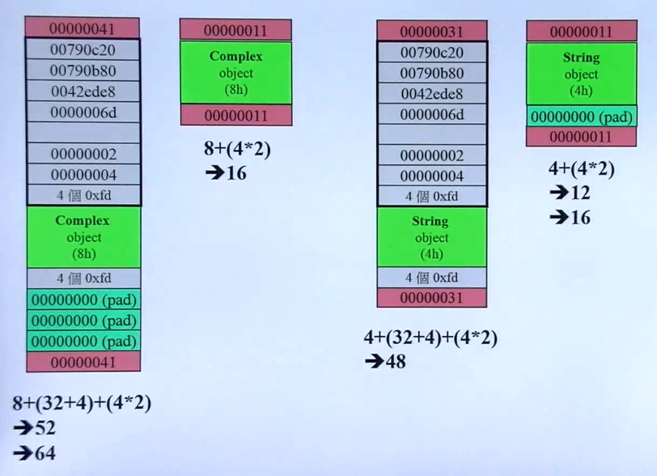

## 三大函数 - 以 string 类为例


- 三个特殊函数：拷贝构造，拷贝赋值，析构函数

	
    
    - 存在指针指向的内存，就不能使用默认的拷贝构造函数
    - （Big Three）特殊函数的定义

		```C++
        // 构造函数
        String(const char* cstr = 0);
        // 拷贝构造
        String(const String& str);
        // 拷贝赋值
        String& operator=(const String& str);
        // 析构函数
        ~String();
        ```
        
- 基本构造函数与析构函数的写法

	
    - 成员变量存在指针，就需要动态分配内存
    - 析构函数用于内存清理

		```C++
        String* p = new String("hello");
        delete p;
        ```
        
- 带有指针成员的类必须实现拷贝构造和拷贝赋值

	      
     
     - 使用默认的拷贝构造或拷贝赋值函数仅进行**浅拷贝**，会存在内存泄漏或者不同变量共享内存的危险
     - 拷贝构造和拷贝赋值的目的是为了实现**深拷贝**

- 拷贝构造函数
	

- 拷贝赋值函数
	
	- A = B 基本流程
		- 首先释放 A 的内存，然后分配 与 B 一样大小的空间，然后拷贝 
		- 检测自我赋值的意义：由于相同指针指向同样一块内存，delete 可能会将原来的内存释放
		
    
## 堆，栈与内存管理

- stack 和 heap

	
    - 堆上的内存通过 new 创建，使用完后，必须要进行释放
    - 栈中的变量能够自我回收

- 各种内存对象的声明周期

	- 栈对象的生命周期

	以 {} 表示作用域
    ```C++
    {
    	Complex c(1,2);
    } // 调用 Complex 析构函数，销毁内存
    ```
	
    - 静态对象的生命周期

	在 {} 作用域外依然存在，直到程序结束
    
    ```C++
    {
    	static Complex c(1,2);
    } // 不会调用 Complex 析构函数，销毁内存
    ```
    
    - 全局对象的生命周期

	可以视为 static 变量，作用域是整个程序
    
    ```C++
    class Complex {...};
    
    Complex c(1,2); // 全局对象
    
    int main()
    {}
    ```
    
  - 堆对象的声明周期
	

- new 的操作流程

	new 的三个流程
    
    - 分配内存 （operator new -> malloc）
    - 内存类型转换（void\*），返回指针
    - 指针调用构造函数，构造对象

- delete 的操作流程

	
    
- 动态分配的内存块

	
    - 创建一个 Complex 对象的内存分配

		- debug 模式下的灰色内存
		- 浅绿色为真正一个 Complex 对象的内存
		- 深绿色 pad 为了补足内存 16字节 对齐
		- 头尾粉色是 cookie，作为是否已经释放的标志字节以及对应的内存大小

- 动态分配的数组 array
	
    
	- 多记录一个数组元素的数量

- new 必须与 delete 相匹配（单个对象以及数组的情形）
	
	