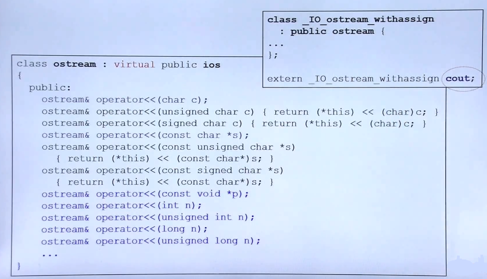

## 扩展与补充

- static 的概念（静态成员与静态函数）

	
    
    - this pointer 提供非静态成员函数的数据指针
    - 由 **static** 标记的数据实现了**与类的分离**，有且仅有一份

		往往应用于类中各个对象所共享的数据成员，非对象独特
    - 由 **static** 标记的方法有且仅有一份

		**没有显式的 this pointer，所以只能处理静态成员变量。**
        
  - example
	
    - 各个对象所共享的数据成员
		
    
        - 静态成员函数需要在类的外部进行初始化
        - 注意静态成员函数的调用方法
    
    - 单例模式

		
        
        - 构造函数被私有化，不允许外部创建对象
        - 通过 **static** 构建了类中唯一一个成员变量，外界只能使用
        - 更优的使用方法（只有外部调用才产生该变量）

			

			
- cout 的概念

	
    - 进行了非常多的 **<<**操作符重载

- class template 模板

	
    - 编译器会根据绑定的类型进行 type 的替换

- function template 模板

	
    - 函数模板会对参数类型进行推导，不需要额外指明绑定类型

- namespace

	