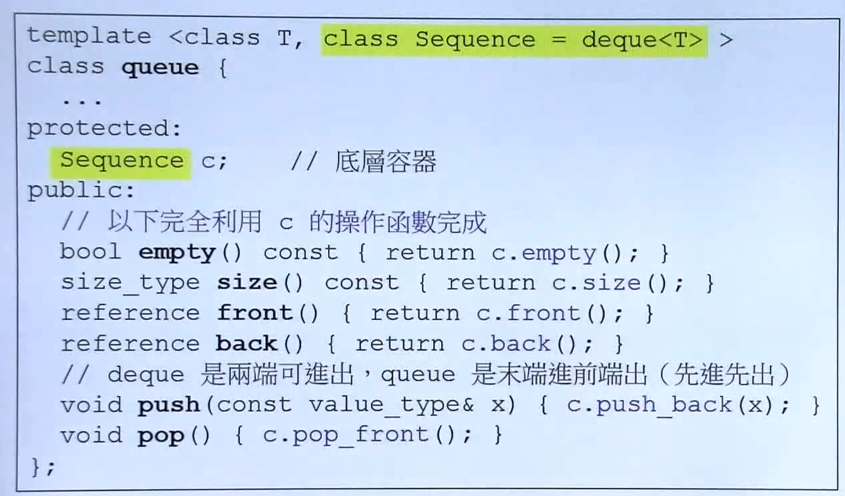
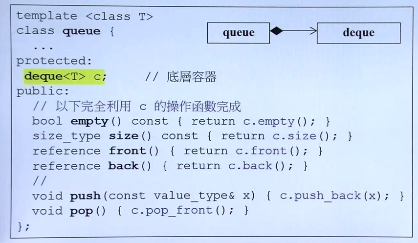
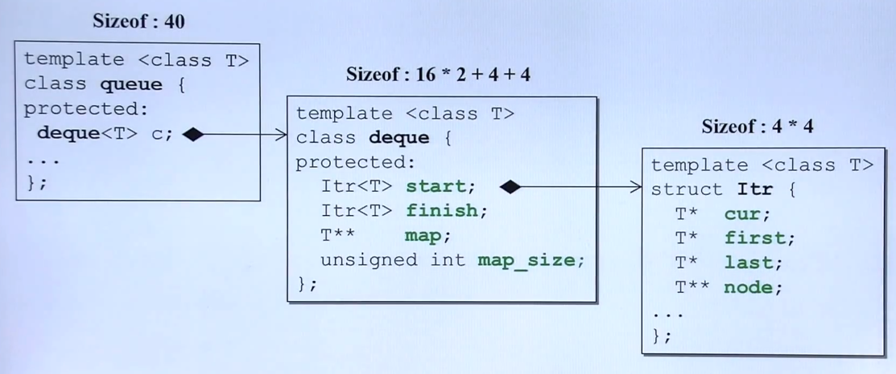
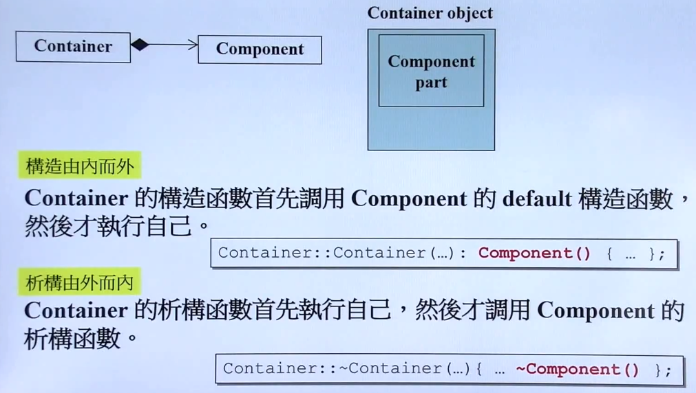
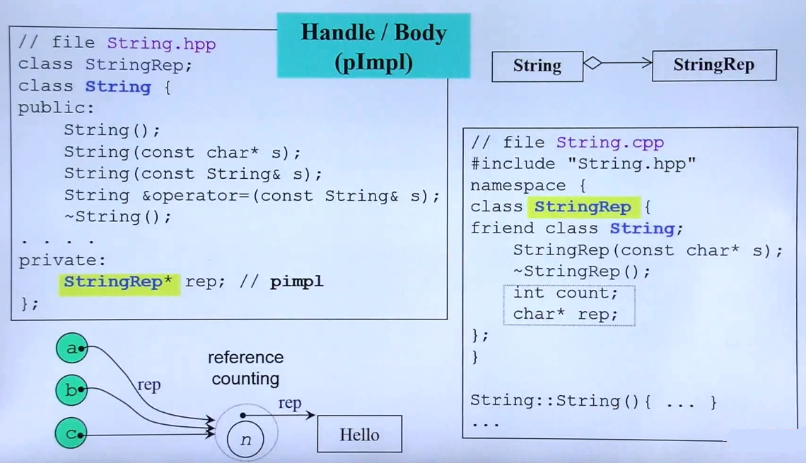
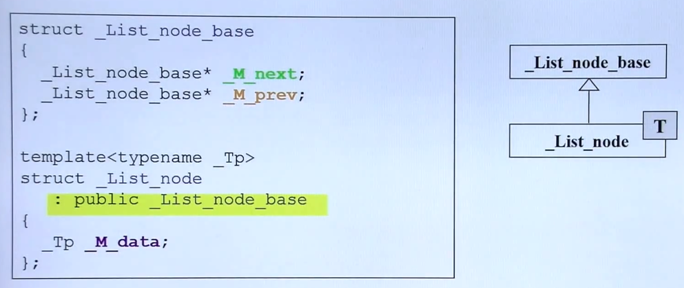
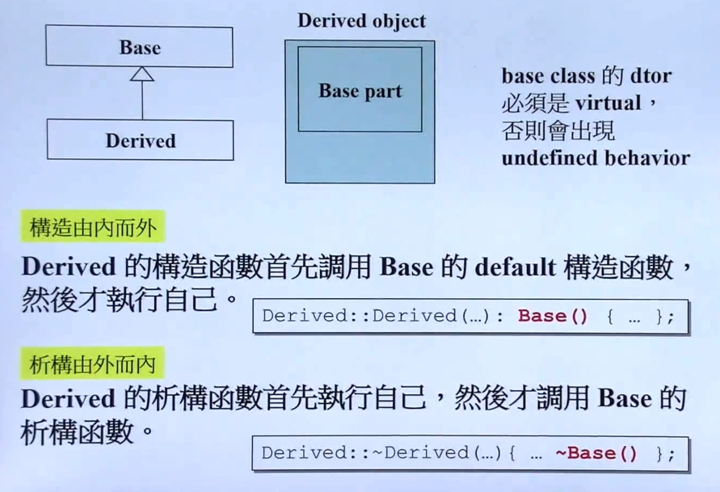

## 组合与继承

- 类与类之间的基本关系

	- 继承（Inheritance）
	- 复合（Composition）
	- 委托（Delegation）

- **复合（Composition） 表示 has-a**
	
    - 示例
        
        - queue 的 class 中嵌有另一种类 Sequence 的实例（必要）
        - queue 的具体方法完全是调用 deque 的方法实现（非必要）
        - 图示法表示如图
            

            - **adapter 的设计模式**

                - 对**原有的类的接口进行限制与重新封装，形成一个新的类**，这种模式就是适配器模式
        
 - 从内存角度看复合（Composition） 
 	
    
 - 复合关系下的构造与析构

	
    - 构造由内而外的构造特性（编译器进行）
    
    	注意编译器默认使用 Components 的默认构造函数，否则需要显式写明调用的构造函数
    - 析构需要由外而内

- **委托（Delegation）Composition by reference**

	- 示例
		
        - 一个类中存在一个指向另一个类对象的指针（另一个类尚未进行构造）
        - 与复合内外生命一致，委托内外生命不一致，指向另一个类的指针只在必要时起作用
        - 这种方式可以将实现与接口完全分离，外部的类（左边）提供接口，内部的类（右边）进行具体实现，接口调用内部类的指针进行工作。
        - 这样的好处就是接口不变的前提下，可以替换实现的具体方案
        - 委托这样做还有一个功能就是 **引用计数**，对于共享内存的对象，内部共用一个指针，且指针指向的类中存在 count 进行计数（shared_ptr的细节）

- **继承（Inheritance）表示 is-a（public）**

	- 基本语法与图示
	
    
    - 从内存上看继承
	
   