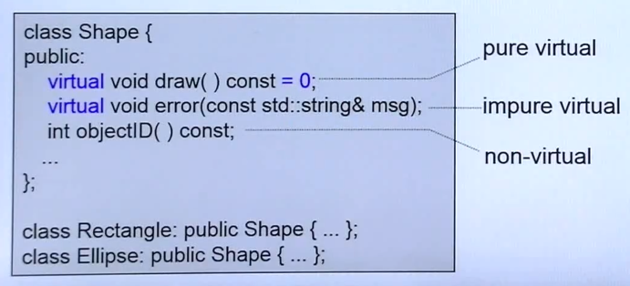
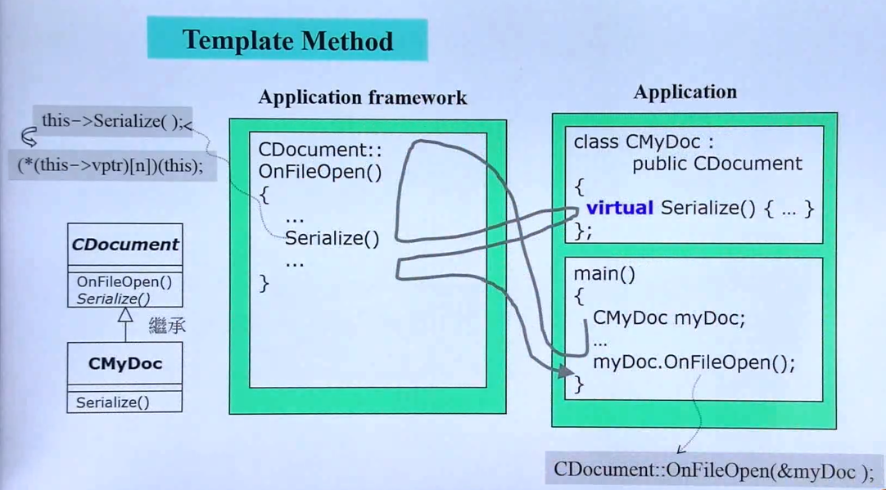
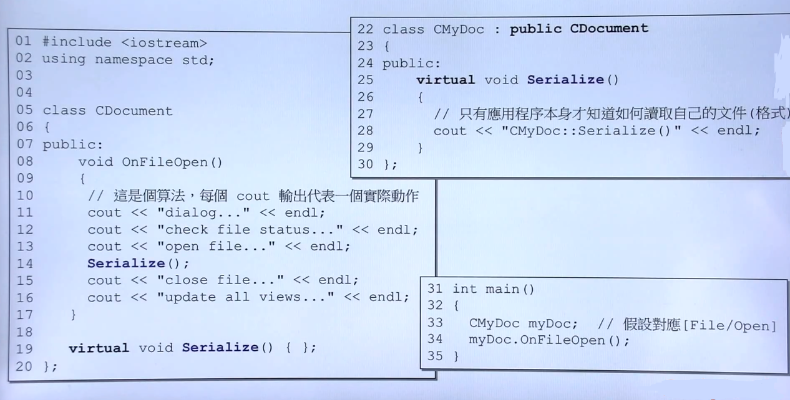
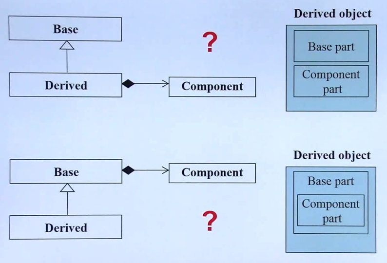

## 虚函数与多态

- 基于虚函数的继承

	
    - **non-virtual**:不能被子类复写**(override)**父类的函数
    - **virtual**：子类能重写父类的函数，父类的这个函数就需要由默认定义
    - **pure virtual**：子类必须一定要重写父类的函数方法
    - 父类 shape 往往是一个抽象的概念，就是一个抽象类
    - 虚函数的调用流程以及重要用法
    	
        
        - Serialize() 函数 是父类的虚函数
        - 通过子类调用父类函数时，遇到父类的虚函数时，会转调用子类的虚函数
        - 这是一种**模板方法(Template Method)**设计模式:同一类的应用程序由于具有一些共性操作，由一个框架在外部统一定义，具体实现由子类的虚函数实现。
        - 子类对象能够调用父类方法，并在虚函数使用时转调用自己的方法，主要是通过一个隐式指针**(this)**传递到函数中

- 继承 + 复合关系下的构造与析构		
	
    
    - 第一种：先执行父类构造函数，再执行复合类的构造函数，最后执行本类的构造函数。而析构次序反之。
    - 第二种：先执行Component的构造函数，再执行Base的构造函数，最后执行Derived的构造函数。而析构次序反之。