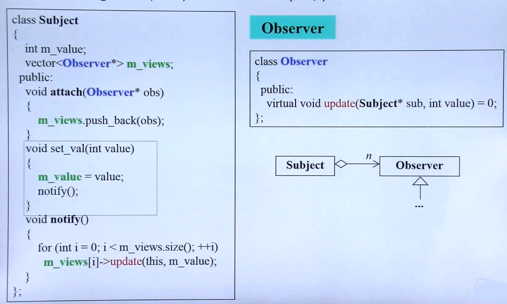
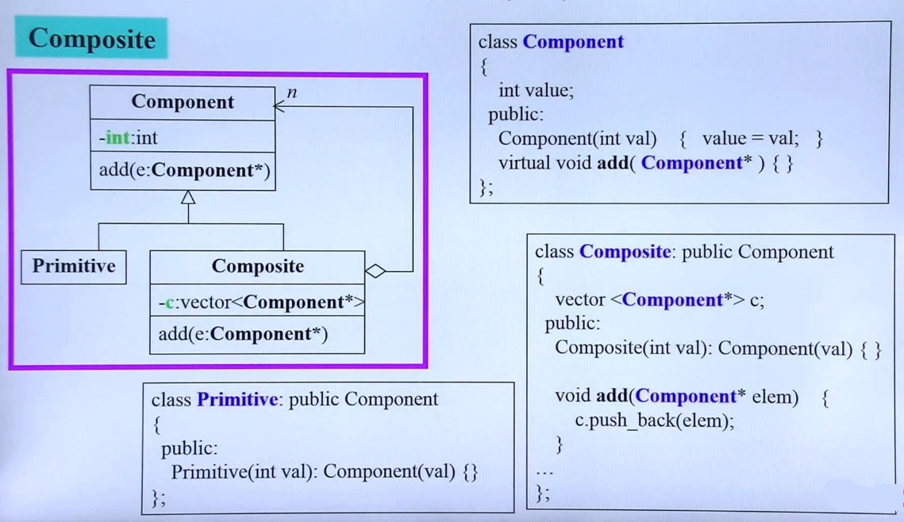
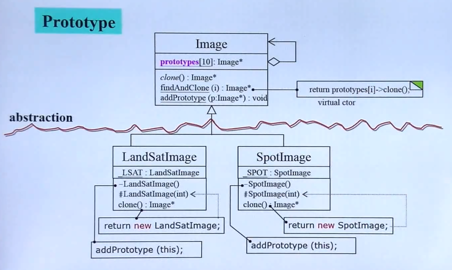
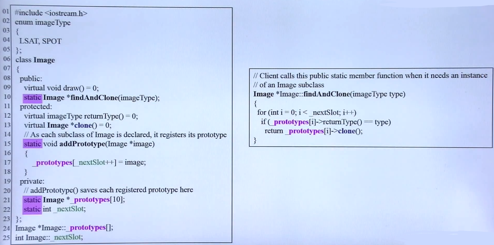

## 案例分析

- **委托 + 继承**的结合应用
    - **观察者模式**
        UI设计中，同时由多个窗口观察正在处理的数据
        
        - Observer的指针作为委托存在 **Subject** 类中，**Observer** 可以被继承，就可以实现 **Subject** 类绑定不同的 **Observer** 对象
        -  **Subject** 类需要提供  **Observer** 对象 的注册函数（更新 **m_views** 变量）以及一个通知函数，用来调用**Observer** 对象的 **update** 方法，获取 **Subject** 类的更新。实现了**观察者模式**。

	- **组合模式**

		文件系统的构建
        
        - **Primitive**(基本的file文件)，**Composite** 可以容纳自己也可以容纳 Primitive
        - 所以通过一个基类 **Component** 包含上述两种类的功能，同时子类具有父类对象的指针

	- **原型模式**

		创建未来才会出现的子类（父类中未知的子类构造），框架的制作
        
        
        - <u>LSAT</u>  表示静态对象
        - 子类通过**私有构造函数**创建自己的对象，并将这个对象通过 **addPrototype** 函数注册到父类的 **prototypes** 中
        - $-$ 表示 private, $+$ 表示 public, $ \# $ 表示 protected
        - clone 函数制作副本
        - 源代码
        	
            - $ \# $的构造函数是为了防止在子类构建时自动向父类注册