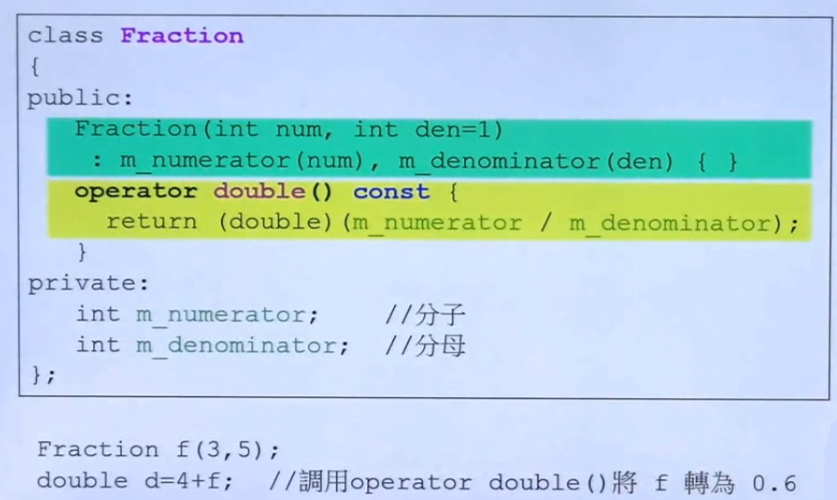
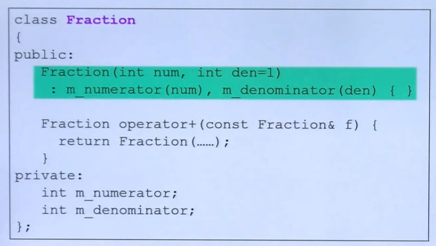
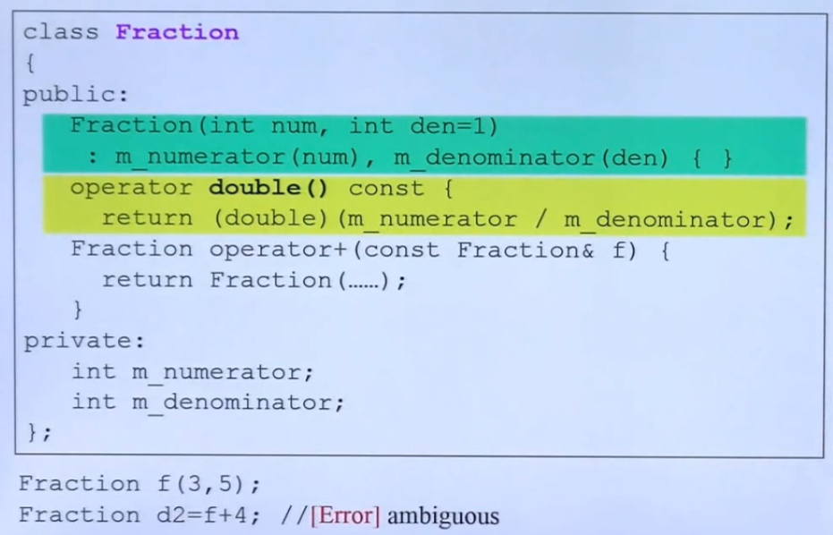
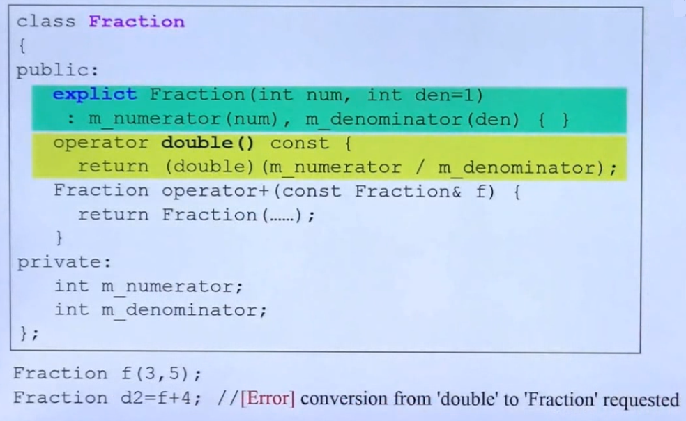

## 转换函数

- 类间的转换 - 以类型转换为例

	
    - operator double() 表明可以将该类型转为 double()，没有返回类型

- non-explicit-ctor
	
    
	- one-argument 表明构造函数只要传入一个参数即可，因为另一个参数具有默认传参
	- 使用特性: non-explicit-ctor 支持别种的类型转换为 Fraction
		```C++
        Fraction f(3,5);
        // 由于 operator + 只支持对 Fraction 对象进行操作
        // 会将 4 强制转换为 Fraction 对象（通过调用Fraction(4) 构造函数）
        Fraction d = f + 4;
        ```
    
    - 当 non-explicit 与类间转换函数并存

		
        - Fraction d = f + 4; 存在两种方法转换，就会产生歧义

- explicit-one-argument-ctor

	
    - 经过 explicit 表明 不允许 4 转换为 Fraction 对象
     	